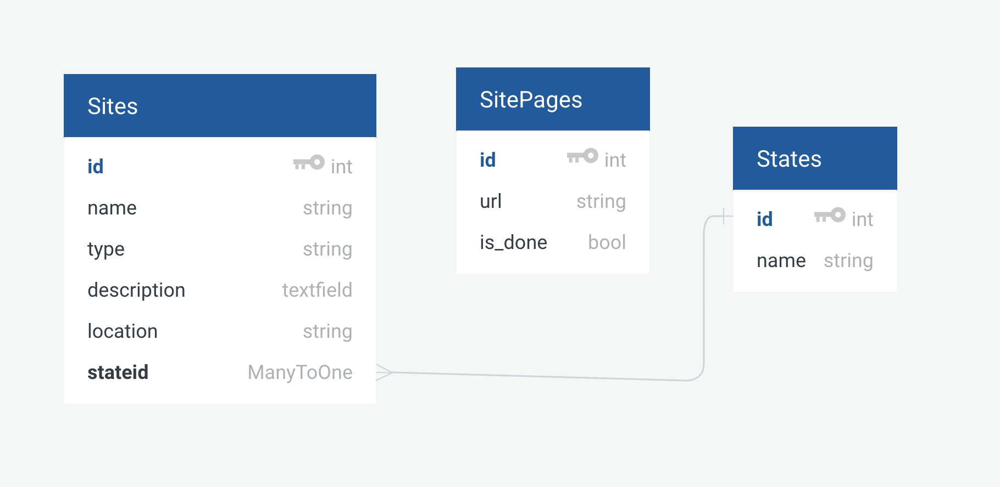

# Project-04-repo-si507

## which project option you chose
option 1

## what your name is
Shaung Cheng

## what your project does, concisely

### Database schema

## how to run your project

# Reference 

- [Proj instr goo doc](https://docs.google.com/document/d/12ysom92FnaIamL38yiYrno7alWyCoRIStK-ME8ORD3Q/edit#)
- [Tool for designing database schema](https://app.quickdatabasediagrams.com/#/d/oo35Ob)

## Dev notes

### Project overall flow:

Do it once

1. [x] (get/navigate to home page)
1. [x] get state index urls
1. [x] get state abbrv
1. [x] store urls & abbrv in db

Loop (plus caching to avoid duplication)

1. (get/navigate to state page)
1. get site element
1. try to get each value
1. store data in db

\# TODO: add in cache plan after one page succceed

## Grading

LINK: The link to your GitHub repository with your project
GRADE: The letter grade of the options below that you are assigning yourself for this project. (see grade guidelines to help you select it. The ones listed are the options -- see syllabus)
GRADE JUSTIFICATION: A BRIEF(!!) sentence describing why you are assigning that letter grade to yourself for this project. (You are welcome but not required to include something you learned or thought was interesting about your learning process, or a plan for your next step/s, but we just want to know briefly why the grade you gave.)
